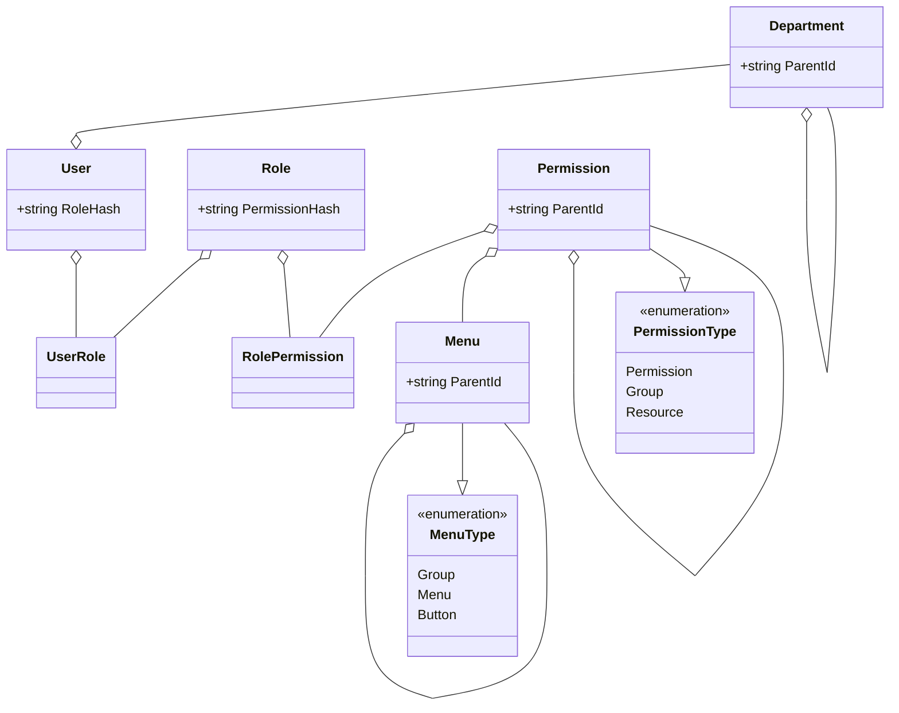

# Web Template Asp.Net

## 解决方案说明

### 目录结构
```
├── README.md
├── src
│   ├── WTA.Web                     # Web API
│   ├── WTA.Application             # 应用层
│   ├── WTA.Infrastructure          # 基础设施层
├── tests
│   ├── WTA.Application.Tests       # 应用层测试
```

### Web API

依赖 应用层 和 基础设施层，不直接依赖三方库。

### Application

应用层，包含领域代码、应用代码。不依赖基础设施层，定义了基础设施层必须实现的接口，不依赖三方库。

### Infrastructure

基础设施层，包含应用层接口的实现和Web层的通用代码，三方库的引用在此项目中。

### Web.UI

前端项目


## 权限系统

1. 用户、角色、权限、菜单四种实体
1. 资源及其操作使用权限表示，权限采用树形结构，权限的类型可以为分组、资源、操作三种
1. 菜单采用树形结构，菜单的类型可以为分组、菜单和按钮三种，按钮可以配置操作行数（单行、多行）和显示位置（顶部、行末）
1. 给用户添加删除角色时，更新用户的状态列md5，md5由用户的角色的状态列排序后计算得出,每次md5变动时，需要刷新菜单
1. 给角色添加或权限时，需要更新角色的状态列md5，md5由用户权限排序后根据number计算得出，同时查找所有使用该角色的用户，更其性能其状态列md5
1. 在配置表种新增菜单状态（md5）配置，每次修改菜单时序列化整个菜单计算md5
1. 登录时，客户端缓存菜单md5和用户md5，每次请求返货菜单md5和用户md5，决定是否重新请求菜单和权限重新渲染菜单
1. 用户角色关联、角色权限关联可以考虑在扩展时添加截至时间等条件字段



